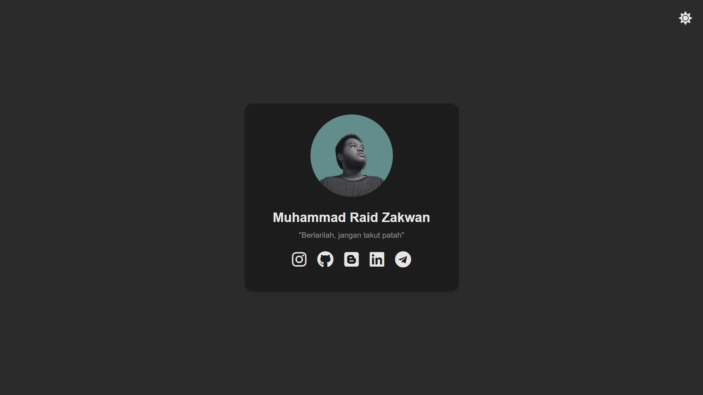
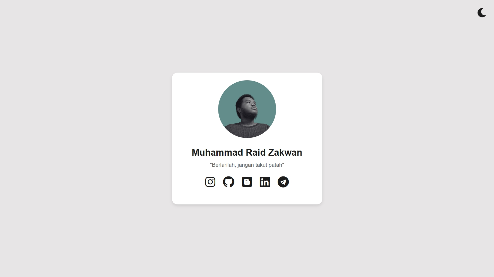

# Social Media Landing Page

This project is a simple, visually appealing landing page for a personal social media profile. It features a card with a profile picture, name, and a motivational quote, along with icons linking to various social media platforms.

## Key Features
- **Responsive Design**: The layout adjusts seamlessly across different screen sizes and devices.
- **Dark Mode**: Toggle between light and dark themes to suit user preferences.
- **Interactive Elements**: Hover effects on social media icons enhance user engagement.
- **Preventive Measures**: Right-click, text selection, and keyboard shortcuts for viewing the source code are disabled to protect content.

## Technologies Used
- **HTML**: Structure of the webpage.
- **CSS**: Styling, animations, and responsiveness.
- **JavaScript**: Theme toggling and preventive measures.

## How to Use
1. **Profile Customization**: Update the profile picture, name, and quote in the HTML file.
2. **Social Links**: Replace the `href` attributes of the social media icons with your own profile URLs.
3. **Theme Toggle**: Click the moon/sun icon to switch between light and dark themes.

## Folder Structure
- `index.html`: Main HTML file.
- `assets/images/`: Directory for profile picture.

## Setup
No additional setup is required. Simply open `index.html` in your browser to view the landing page. Customize the HTML as needed to personalize your social media profile.

## Preview

## License
This project is open-source and available under the MIT License.
